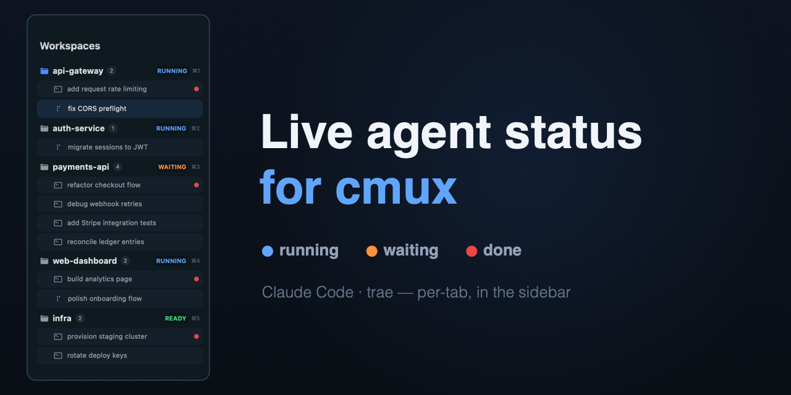

# Conductor Sidebar for cmux

A [Conductor](https://conductor.build)-style custom sidebar for [cmux](https://cmux.com), with **live per-tab agent status** — see at a glance which Claude Code / trae session is running, waiting for input, or done.



## Features

- **Workspace-grouped sidebar**: every tab listed under its workspace, click to jump, drag to reorder.
- **Live per-tab status** (the main point):
  - 🔵 an animated spinner while an agent is working — **keeps spinning even when the tab is in the background** (self-drawn from `clock`, not the terminal's own cursor).
  - 🟠 a `WAITING` pill when the agent needs your input.
  - 🔴 a red dot the moment a task finishes — **clears when you open that tab**.
- **Right-click menu** on a workspace: rename, pin, move up/down/top, mark read, new tab, close.
- Works with both **Claude Code and trae**.
- **One-command install** that backs up your existing config first; clean uninstall; re-run install to update safely.

## Requirements

- macOS + [cmux](https://cmux.com)
- `python3` (bundled with macOS)

## Install

```bash
git clone https://github.com/qucooln/cmux-conductor-sidebar.git
cd cmux-conductor-sidebar
bash install.sh
```

Install **backs up** your existing `~/.claude/settings.json`, `~/.config/cmux/cmux.json`, and `~/.trae/hooks.json` to `~/.config/cmux/conductor-backup-<timestamp>/`. All config changes are **idempotent merges** — your other hooks/settings are left alone. Re-running `install.sh` is a safe update.

The sidebar auto-activates. If it doesn't: right-click cmux's sidebar-toggle button → pick **conductor**, or run `cmux sidebar select conductor`.

## How it works

cmux's custom-sidebar DSL can only read cmux's built-in data, which has **no per-tab agent status**. This project bridges that gap:

1. A small hook (`cmux-status.sh`) is registered on Claude Code / trae lifecycle events (`UserPromptSubmit`→running, `PreToolUse`→running, `Notification`→waiting, `Stop`→done, …).
2. It records each session's state under `~/.cache/cmux-status/` and aggregates it into that workspace's `progress.label`, e.g. `RUNNING run:<uuid> done:<uuid>`.
3. The sidebar (`conductor.swift`) parses that label to draw the per-tab spinner / red dot, animated via the DSL's `clock` so it keeps moving for backgrounded tabs.
4. Opening a tab sends a "seen" signal (a tiny internal notification intercepted by a notification hook) that clears its red dot.

A 3-minute watchdog also downgrades any `running` that stops refreshing (e.g. a session killed without a `Stop`), so nothing gets stuck spinning.

## Uninstall

```bash
bash uninstall.sh
```

Precisely removes only what this package added (hooks, files, config keys). Your other config and the install-time backup are kept.

## Files

| file | purpose |
|---|---|
| `files/conductor.swift` | the sidebar UI (cmux custom-sidebar DSL) |
| `files/cmux-status.sh` | per-session status reporting + workspace aggregation |
| `files/cmux-rename-hook.sh` | rename dialog + "seen" red-dot clear (notification hook) |
| `install.sh` / `uninstall.sh` | orchestration (backup → files → config merge → activate) |
| `merge.py` | idempotent merge/removal for settings.json / trae hooks / cmux.json |

## Notes & limitations

- Status hooks are read **per-event** by Claude Code / trae, so changes take effect on already-running sessions without a restart.
- A red dot clears when you click the tab **from this sidebar** (that's what sends the "seen" signal). Switching via `cmd+number` or the top tab bar won't clear it; sending a new prompt to that agent also clears it.
- If you turn on cmux's `workspaceAutoNaming`, its background auto-namer briefly registers as "running" — this package leaves that setting off.

## License

MIT — see [LICENSE](LICENSE).

## Disclaimer

This is an independent, community-built project. It is **not affiliated with, endorsed by, or sponsored by** Conductor ([conductor.build](https://conductor.build)), [cmux](https://cmux.com), or Anthropic. "Conductor", "cmux", and "Claude" are trademarks of their respective owners; they are referenced here only to describe compatibility and design inspiration. All code and assets in this repository are original work by the author.

---

Made for the cmux community. Questions & feedback welcome on the [cmux Discord](https://discord.gg/xsgFEVrWCZ).
